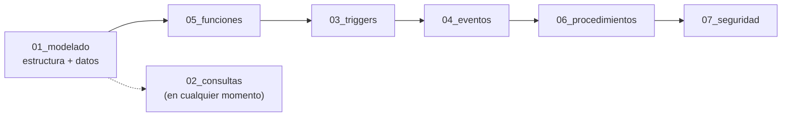
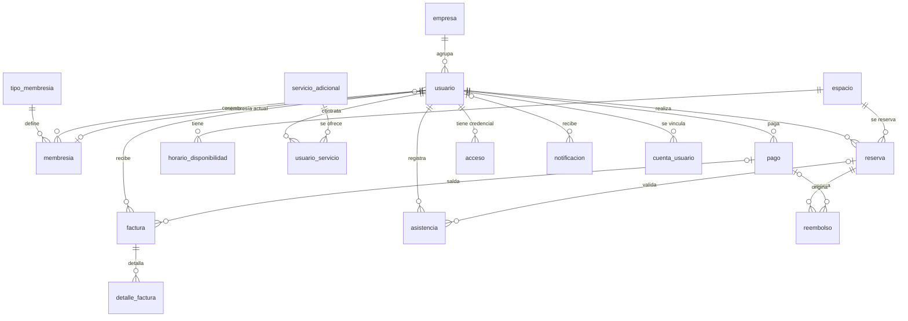

<div align="center">

# 🏢 Gestión de Coworking y Oficinas Compartidas

### Base de datos MySQL para administrar membresías, reservas, pagos, accesos y reportes financieros de un espacio de coworking


**Proyecto #1 · Curso MySQL II**

</div>

---

## 📑 Tabla de contenido

1. [Descripción del proyecto](#-descripción-del-proyecto)
2. [Requisitos del sistema](#-requisitos-del-sistema)
3. [Estructura del repositorio](#-estructura-del-repositorio)
4. [Instalación y configuración](#-instalación-y-configuración)
5. [Estructura de la base de datos](#-estructura-de-la-base-de-datos)
6. [Ejemplos de consultas](#-ejemplos-de-consultas)
7. [Procedimientos, funciones, triggers y eventos](#-procedimientos-funciones-triggers-y-eventos)
8. [Roles de usuario y permisos](#-roles-de-usuario-y-permisos)
9. [Consideraciones importantes](#-consideraciones-importantes)
10. [Contribuciones](#-contribuciones)
11. [Licencia y contacto](#-licencia-y-contacto)

---

## 📖 Descripción del proyecto

**Gestión de Coworking y Oficinas Compartidas** es una base de datos relacional diseñada para administrar todas las operaciones de un espacio de coworking moderno: desde el registro de usuarios y sus membresías hasta el control de acceso con tarjeta RFID o código QR y los reportes financieros.

El objetivo es contar con una solución **robusta, escalable y cercana a la realidad de un coworking**, donde conviven personas independientes y empresas, se reservan escritorios, oficinas privadas, salas de reuniones y salas de eventos, y se factura tanto por membresías como por reservas y servicios adicionales.

### ✨ ¿Qué se implementó?

| Módulo | Qué incluye |
|---|---|
| 👥 **Usuarios y membresías** | Usuarios, empresas, 4 tipos de membresía (Diaria, Mensual, Corporativa, Premium) y 3 estados (Activa, Suspendida, Vencida). |
| 🗓️ **Espacios y reservas** | 4 tipos de espacio con capacidad máxima, horarios de disponibilidad y reservas con duración. |
| ➕ **Servicios adicionales** | Internet premium, lockers, café ilimitado, impresiones, proyector, parqueadero, ligados a usuarios y a la facturación. |
| 💳 **Pagos y facturación** | 4 métodos de pago, estados de transacción, facturas con detalle, IVA del 19 %, recargos por mora y reembolsos. |
| 🔐 **Control de acceso y asistencia** | Credenciales RFID/QR, validación de membresía activa o reserva previa e historial de asistencias. |
| 📊 **Automatización y reportes** | 100 consultas, 20 triggers, 20 eventos programados, 20 funciones y 20 procedimientos almacenados. |
| 🛡️ **Seguridad** | 5 roles de MySQL con permisos de mínimo privilegio. |

---

## 🧰 Requisitos del sistema

| Requisito | Detalle |
|---|---|
| **MySQL Server** | **8.0 o superior** (se usan CTE recursivos, funciones de ventana, `JSON_TABLE` y roles, que no existen en MySQL 5.7). |
| **Cliente** | MySQL Workbench 8.0+ o la consola `mysql`. Debe soportar la instrucción `DELIMITER`. |
| **Privilegios** | Una cuenta administradora (por ejemplo `root`) para crear la base, los eventos, los roles y los usuarios. |
| **Programador de eventos** | `event_scheduler = ON` (el script de eventos lo activa; requiere privilegio `SUPER` o `SYSTEM_VARIABLES_ADMIN`). |
| **Git** | Para clonar el repositorio. |

Para comprobar la versión de MySQL:

```sql
SELECT VERSION();
```

---

## 🗂️ Estructura del repositorio

Los scripts están divididos en carpetas según su propósito. El número de cada carpeta corresponde al módulo del enunciado.

```text
PROYECTO-MySQL-II/
├── README.md
├── docs/
│   ├── diagrama_proyecto.jpg    → diagrama lógico del modelo
│   └── roles_permisos.md        → roles, permisos y matriz de accesos en detalle
└── sql/
    ├── 01_modelado/            # DDL y DML
    │   ├── 01_estructura.sql        → crea la base de datos y las 14 tablas
    │   └── 01_datos_iniciales.sql   → carga los datos de ejemplo
    ├── 02_consultas/           # Las 100 consultas, organizadas por módulo
    ├── 03_triggers/            # 20 triggers
    ├── 04_eventos/             # 20 eventos programados + tabla de notificaciones
    ├── 05_funciones/           # 20 funciones
    ├── 06_procedimientos/      # 20 procedimientos almacenados
    └── 07_seguridad/           # Roles, permisos y usuarios de ejemplo
        ├── 01_roles.sql
        ├── 02_permisos.sql
        └── 03_usuarios_ejemplo.sql
```

Todos los scripts están comentados: cada sección y cada consulta, procedimiento, evento o trigger explica qué hace y qué supuestos usa.

---

## ⚙️ Instalación y configuración

### 1. Clonar el repositorio

```bash
git clone <URL-del-repositorio>
cd PROYECTO-MySQL-II
```

### 2. Orden de ejecución

Algunos scripts dependen de objetos creados por otros, por eso conviene respetar este orden:



> 💡 Los **eventos** deben ir antes que los **procedimientos**: el script de eventos crea la tabla `notificacion` y las columnas adicionales (`factura.fecha_vencimiento`, `factura.recargo`, `reserva.fecha_creacion`, etc.) que luego usan los procedimientos. La **seguridad** va al final porque otorga permisos sobre todos los objetos anteriores.

### 3. Crear la estructura (DDL)

> ⚠️ `01_estructura.sql` ejecuta `DROP DATABASE IF EXISTS coworking`: **borra la base de datos completa** y la vuelve a crear. Úsalo solo para empezar desde cero.

**Con la consola:**

```bash
mysql -u root -p < sql/01_modelado/01_estructura.sql
```

**Con MySQL Workbench:** `File → Open SQL Script…` → selecciona el archivo → clic en el rayo ⚡ (*Execute*).

### 4. Cargar los datos iniciales (DML)

```bash
mysql -u root -p < sql/01_modelado/01_datos_iniciales.sql
```

Verifica la carga:

```sql
USE coworking;
SELECT COUNT(*) AS usuarios FROM usuario;   -- 10
SELECT COUNT(*) AS reservas FROM reserva;   -- 10
```

### 5. Cargar funciones, triggers, eventos, procedimientos y seguridad

Carpeta por carpeta, en el orden del diagrama. Los scripts de cada carpeta están numerados y se ejecutan en ese orden:

```bash
for f in sql/05_funciones/*.sql;      do mysql -u root -p coworking < "$f"; done
for f in sql/03_triggers/*.sql;       do mysql -u root -p coworking < "$f"; done
for f in sql/04_eventos/*.sql;        do mysql -u root -p coworking < "$f"; done
for f in sql/06_procedimientos/*.sql; do mysql -u root -p coworking < "$f"; done
for f in sql/07_seguridad/*.sql;      do mysql -u root -p coworking < "$f"; done
```

En Workbench basta con abrir cada archivo y ejecutarlo completo (los scripts con `DELIMITER` funcionan sin cambios).

### 6. Ejecutar las consultas

Las 100 consultas están en `sql/02_consultas/`. En Workbench conviene ejecutarlas **de una en una** (coloca el cursor sobre la consulta y presiona `Ctrl + Enter`) para ver cada resultado en su propia pestaña.

> ℹ️ Con los datos de ejemplo, algunas consultas devuelven 0 filas porque ningún registro cumple la condición todavía (por ejemplo, usuarios con más de 20 asistencias). Es el comportamiento esperado: al agregar más datos aparecen resultados.

### 7. Verificar eventos y procedimientos

```sql
-- Eventos programados
SELECT event_name, status, interval_value, interval_field, last_executed
FROM information_schema.EVENTS
WHERE event_schema = 'coworking'
ORDER BY event_name;

-- Procedimientos creados
SHOW PROCEDURE STATUS WHERE Db = 'coworking';

-- Avisos y reportes generados por los eventos
SELECT * FROM notificacion ORDER BY fecha_creacion DESC;
```

---

## 🧱 Estructura de la base de datos

La base de datos `coworking` está compuesta por **14 tablas principales** (las 12 entidades del diagrama lógico más los catálogos `empresa` y `tipo_membresia`) y 3 tablas de apoyo.

### Diagrama lógico

El modelo lógico diseñado por el equipo está en [`docs/diagrama_proyecto.jpg`](docs/diagrama_proyecto.jpg):


En el diagrama, `empresa` y el tipo de membresía aparecen como atributos de `usuario` y `membresia`. En la implementación final se separaron en dos tablas de catálogo para no repetir datos: `usuario.empresaID` apunta a `empresa` y `membresia.tipoID` apunta a `tipo_membresia` (que además guarda el precio y la duración de cada tipo). El resto de entidades, atributos y relaciones se mantienen tal como están en el diagrama.

### Diagrama entidad-relación (modelo implementado)



### Tablas principales

| Tabla | Propósito |
|---|---|
| `empresa` | Empresas cuyos empleados usan el coworking (NIT, contacto, estado). |
| `tipo_membresia` | Catálogo de membresías: Diaria, Mensual, Corporativa y Premium, con precio y duración en días. |
| `usuario` | Personas inscritas: datos básicos, contacto, empresa (opcional) y su membresía actual. |
| `membresia` | Historial de membresías de cada usuario, con fechas de inicio y fin y estado (Activa, Suspendida, Vencida). |
| `espacio` | Escritorios flexibles, oficinas privadas, salas de reuniones y salas de eventos, con capacidad y estado. |
| `horario_disponibilidad` | Días y horas en que cada espacio está disponible. |
| `reserva` | Reservas de un espacio hechas por un usuario: fecha, horario, duración y estado. |
| `servicio_adicional` | Catálogo de servicios extra (internet premium, locker, café, impresiones, proyector, parqueadero). |
| `usuario_servicio` | Servicios contratados por cada usuario, con vigencia y cantidad. |
| `pago` | Transacciones: monto, método (Efectivo, Tarjeta, Transferencia, PayPal) y estado (Pagado, Pendiente, Cancelado). |
| `factura` | Facturas emitidas, con subtotal, impuestos, total y estado; pueden estar ligadas a un pago. |
| `detalle_factura` | Líneas de cada factura (membresía, reserva, servicio, recargo...). |
| `acceso` | Credenciales de ingreso de cada usuario: tarjeta RFID o código QR. |
| `asistencia` | Historial de entradas y salidas, con el resultado de la validación (Autorizado o Rechazado). |

### Tablas de apoyo

| Tabla | Propósito |
|---|---|
| `notificacion` | Cola de avisos y reportes que generan los eventos y procedimientos (recordatorios, reportes al administrador, alertas a recepción, informes al contador). Los eventos de MySQL no envían correos, por eso cada envío queda registrado aquí para que una aplicación lo consuma. |
| `reembolso` | Registro de reembolsos generados al cancelar reservas pagadas. |
| `cuenta_usuario` | Relaciona una cuenta de MySQL con un usuario del coworking, para que los roles *Usuario* y *Gerente Corporativo* solo vean su propia información. |

### Cómo interactúan las tablas

- Un **usuario** puede pertenecer a una **empresa** y tiene un historial de **membresías**; la columna `usuario.membresiaID` apunta a la membresía vigente.
- Cada **reserva** une a un **usuario** con un **espacio**; cuando la persona llega, la **asistencia** queda ligada a esa reserva (o se valida por membresía activa).
- Los **pagos** y las **facturas** se relacionan con el usuario; cada factura tiene sus líneas en **detalle_factura** (por eso se puede saber si una factura corresponde a una membresía, a una reserva o a un servicio).
- Los **accesos** guardan la credencial RFID/QR que se escanea en la puerta y cada ingreso queda en **asistencia**.

### Datos iniciales

El script `01_datos_iniciales.sql` deja la base lista para probar:

| Tabla | Registros | Tabla | Registros |
|---|---|---|---|
| `empresa` | 6 | `servicio_adicional` | 6 |
| `tipo_membresia` | 4 | `usuario_servicio` | 8 |
| `usuario` | 10 | `pago` | 10 |
| `membresia` | 10 | `factura` | 10 |
| `espacio` | 8 | `detalle_factura` | 12 |
| `horario_disponibilidad` | 13 | `acceso` | 10 |
| `reserva` | 10 | `asistencia` | 10 |

---

## 🔎 Ejemplos de consultas

Las 100 consultas se dividen en 5 módulos de 20:

| Módulo | Consultas | Temas |
|---|---|---|
| Usuarios y membresías | 1 – 20 | Estados de membresía, antigüedad, empresas, edades, renovaciones, vencimientos. |
| Espacios y reservas | 21 – 40 | Ocupación, horarios pico, solapamientos, duración promedio, reservas no asistidas. |
| Pagos y facturación | 41 – 60 | Ingresos por concepto y método de pago, facturas pendientes, recaudo anual. |
| Accesos y asistencias | 61 – 80 | Asistencia diaria, constancia, accesos rechazados, franjas de la mañana y la noche. |
| Consultas avanzadas | 81 – 100 | Subconsultas, CTE, funciones de ventana y múltiples `JOIN`. |

### Básica: usuarios con membresía activa (consulta 2)

Muestra quién tiene hoy una membresía activa, de qué tipo y hasta cuándo.

```sql
SELECT u.usuarioID, u.nombre, u.apellido, m.tipo, m.fecha_inicio, m.fecha_fin
FROM usuario u
JOIN membresia m ON m.membresiaID = u.membresiaID
WHERE m.estado = 'Activa'
ORDER BY u.usuarioID;
```

### Intermedia: top 5 de usuarios que más han pagado (consulta 51)

Suma los pagos realizados de cada usuario y devuelve los cinco con mayor total.

```sql
SELECT u.usuarioID, u.nombre, u.apellido, SUM(p.monto) AS total_pagado
FROM usuario u
JOIN pago p ON p.usuarioID = u.usuarioID
WHERE p.estado = 'Pagado'
GROUP BY u.usuarioID, u.nombre, u.apellido
ORDER BY total_pagado DESC
LIMIT 5;
```

### Avanzada: empresas que generan más del 20 % de los ingresos (consulta 85)

Calcula el aporte de cada empresa a los ingresos totales con subconsultas y deja solo las que superan el 20 %.

```sql
SELECT
    e.empresaID,
    e.nombre AS empresa,
    SUM(p.monto) AS ingresos_empresa,
    ROUND(SUM(p.monto) * 100
          / (SELECT SUM(monto) FROM pago WHERE estado = 'Pagado'), 2) AS porcentaje_ingresos
FROM empresa e
JOIN usuario u ON u.empresaID = e.empresaID
JOIN pago    p ON p.usuarioID = u.usuarioID
WHERE p.estado = 'Pagado'
GROUP BY e.empresaID, e.nombre
HAVING SUM(p.monto) > 0.20 * (SELECT SUM(monto) FROM pago WHERE estado = 'Pagado')
ORDER BY porcentaje_ingresos DESC;
```

### Avanzada: ingresos mensuales acumulados con función de ventana (consulta 99)

Agrupa los pagos por mes y usa `SUM() OVER` para obtener el acumulado.

```sql
SELECT
    mes,
    ingresos_mes,
    SUM(ingresos_mes) OVER (ORDER BY mes) AS ingresos_acumulados
FROM (
    SELECT DATE_FORMAT(fecha_pago, '%Y-%m') AS mes, SUM(monto) AS ingresos_mes
    FROM pago
    WHERE estado = 'Pagado'
    GROUP BY DATE_FORMAT(fecha_pago, '%Y-%m')
) m
ORDER BY mes;
```

---

## ⚡ Procedimientos, funciones, triggers y eventos

### 🛠️ Procedimientos almacenados (20)

Encapsulan operaciones completas del negocio. Los que escriben en varias tablas usan transacciones y validan los datos con `SIGNAL`, de modo que un error no deja información a medias. Los resultados se devuelven en parámetros `OUT`.

| Módulo | Procedimiento | Qué hace |
|---|---|---|
| **Membresías** | `sp_registrar_membresia` | Crea una membresía con fecha de inicio, fin y estado Activa, y la asigna al usuario. |
| | `sp_renovar_membresia` | Extiende la vigencia según el tipo contratado. |
| | `sp_actualizar_membresias_vencidas` | Marca como Vencida toda membresía cuya fecha de fin ya pasó. |
| | `sp_suspender_membresias_impagas` | Suspende membresías de usuarios con facturas impagas por más de *X* días y les avisa. |
| **Reservas y espacios** | `sp_verificar_disponibilidad_espacio` | Comprueba que no haya solapamiento de horarios ni mantenimiento. |
| | `sp_crear_reserva` | Crea una reserva en estado Pendiente (bloquea el espacio para evitar cruces). |
| | `sp_confirmar_reserva_con_pago` | Registra el pago, genera la factura y confirma la reserva. |
| | `sp_cancelar_reserva_con_reembolso` | Cancela la reserva y genera un reembolso total o parcial según la anticipación. |
| | `sp_liberar_reservas_no_confirmadas` | Cancela las reservas Pendientes que superan *X* horas sin confirmar. |
| **Pagos y facturación** | `sp_generar_factura_membresia` | Crea la factura (con IVA) al activar o renovar una membresía, pendiente o ya pagada. |
| | `sp_generar_factura_consolidada_empresa` | Agrupa en una sola factura los cargos pendientes de los empleados de una empresa. |
| | `sp_aplicar_recargos_facturas_vencidas` | Incrementa el total de facturas con más de *X* días de atraso, una sola vez por factura. |
| | `sp_bloquear_servicios_por_impago` | Bloquea los servicios adicionales de usuarios con facturas vencidas. |
| **Accesos y asistencias** | `sp_registrar_entrada` | Lee el código RFID/QR, valida membresía vigente o reserva y registra la entrada. |
| | `sp_registrar_salida` | Completa la asistencia abierta con la hora de salida. |
| | `sp_reporte_diario_asistencias` | Resume ingresos, usuarios únicos y horas pico del día. |
| | `sp_marcar_no_show_y_penalizar` | Marca como *No Show* las reservas confirmadas sin asistencia y factura la penalización. |
| **Corporativos y administración** | `sp_registrar_lote_empleados` | Registra varios empleados de una empresa (JSON) con membresía Corporativa. |
| | `sp_cancelar_reservas_futuras_usuario` | Cancela las reservas futuras de un usuario cuando pierde su membresía. |
| | `sp_reporte_ingresos_mensuales_acumulados` | Ingresos por mes e ingreso acumulado del año. |

> Además existe `sp_aux_numero_factura`, un procedimiento auxiliar que genera el siguiente número de factura (`FAC-AAAA-NNNN`).

**Ejemplos de uso**

```sql
-- Reservar, pagar y cancelar con reembolso
CALL sp_crear_reserva(2, 5, '2026-10-20', '09:00', '11:00', @reserva);
CALL sp_confirmar_reserva_con_pago(@reserva, 50000, 'Tarjeta', 'TRX-9001', @pago, @factura);
CALL sp_cancelar_reserva_con_reembolso(@reserva, NULL, @reembolso);   -- NULL = política automática
SELECT @reserva, @pago, @factura, @reembolso;

-- Control de acceso con una credencial
CALL sp_registrar_entrada('RFID-A1B2C3D4', @resultado, @mensaje);
SELECT @resultado, @mensaje;

-- Alta de empleados de una empresa
CALL sp_registrar_lote_empleados(1,
  '[{"nombre":"Ana","apellido":"Lopez Diaz","edad":29,"contacto":"ana@mail.com | 3001112233"}]',
  NULL, @registrados);

-- Reportes
CALL sp_reporte_diario_asistencias(NULL);                 -- NULL = hoy
CALL sp_reporte_ingresos_mensuales_acumulados(2026);
```

### 🧮 Funciones (20)

Las funciones encapsulan cálculos reutilizables del negocio para usarlos directamente dentro de consultas, procedimientos, triggers y eventos, sin repetir la lógica. Se invocan como cualquier función de MySQL, por ejemplo `SELECT nombre_funcion(parametros);`. Se encuentran en `sql/05_funciones/`.

### 🎯 Triggers (20)

Reaccionan automáticamente a los cambios en los datos para mantener la coherencia sin intervención manual. Se encuentran en `sql/03_triggers/`.

| Módulo | Qué hacen |
|---|---|
| **Membresías** | Calculan la fecha de vencimiento al crear una membresía · Pasan la membresía a Activa cuando se registra un pago exitoso · La pasan a Suspendida si no se paga antes de la fecha límite · Registran en un log cada cambio de tipo de membresía · Impiden eliminar una membresía si el usuario tiene reservas activas. |
| **Reservas** | Validan que no existan reservas duplicadas en el mismo espacio, fecha y hora · Asignan el estado inicial pendiente de confirmación · Confirman la reserva al registrar su pago · Cancelan las reservas si el usuario elimina su membresía · Registran en un log cada cancelación. |
| **Pagos y facturación** | Crean la factura al registrar un pago · La marcan como Pagada al confirmarse el pago · Impiden eliminar un pago que ya tiene factura · Actualizan el saldo pendiente en pagos parciales · Registran en un log los pagos anulados. |
| **Accesos** | Registran la asistencia al validar un acceso con QR o tarjeta · Bloquean el acceso sin membresía activa · Actualizan la última fecha de acceso del usuario · Cierran la salida automáticamente si el usuario vuelve a entrar sin haber salido · Registran en un log cada intento rechazado. |

### ⏰ Eventos programados (20)

Tareas automáticas que se ejecutan solas mientras el programador de eventos esté activo. Como MySQL no envía correos, los avisos y reportes se guardan en la tabla `notificacion` con su destinatario (Usuario, Administrador, Recepción o Contador).

| Módulo | Evento | Frecuencia | Qué hace |
|---|---|---|---|
| **Membresías** | `ev_membresias_vencidas` | Diario 00:05 | Actualiza a Vencida las membresías que cumplieron su fecha de fin. |
| | `ev_recordatorio_renovacion` | Diario 08:00 | Avisa al usuario 5 días antes de que venza su membresía. |
| | `ev_suspender_membresias_sin_pago` | Diario 00:10 | Suspende membresías con facturas de membresía sin pagar hace más de 30 días. |
| | `ev_reporte_semanal_membresias` | Lunes 07:00 | Reporte al administrador de las nuevas membresías de la semana. |
| | `ev_notificar_membresias_suspendidas` | Diario 08:00 | Informa a recepción las membresías suspendidas. |
| **Reservas** | `ev_cancelar_reservas_no_confirmadas` | Cada 10 min | Cancela reservas Pendientes con más de 2 horas sin confirmar. |
| | `ev_recordatorio_reserva` | Cada 5 min | Avisa al usuario 1 hora antes de su reserva. |
| | `ev_eliminar_reservas_no_asistidas` | Diario 02:00 | Elimina reservas pasadas hace más de 7 días a las que nadie asistió. |
| | `ev_reporte_semanal_ocupacion` | Lunes 07:30 | Reporte semanal de ocupación por espacio. |
| | `ev_liberar_reservas_no_iniciadas` | Cada 5 min | Libera reservas confirmadas que no empezaron en los primeros 15 minutos. |
| **Pagos y facturación** | `ev_recordatorio_pago_pendiente` | Cada 3 días 09:00 | Recuerda al usuario sus facturas pendientes. |
| | `ev_bloquear_servicios_facturas_vencidas` | Diario 00:20 | Bloquea servicios adicionales con facturas vencidas hace más de 10 días. |
| | `ev_resumen_facturacion_mensual` | Día 1, 00:30 | Resumen de la facturación del mes anterior. |
| | `ev_recargo_facturas_vencidas` | Diario 00:30 | Aplica un recargo a facturas vencidas hace más de 15 días. |
| | `ev_reporte_ingresos_contador` | Diario 23:50 (actúa fin de mes) | Envía al contador los ingresos del mes y los acumulados del año. |
| **Accesos y asistencias** | `ev_eliminar_accesos_antiguos` | Diario 03:00 | Elimina registros de asistencia de más de 1 año. |
| | `ev_reporte_diario_asistencias` | Diario 23:55 | Reporte diario de asistencias al administrador. |
| | `ev_reporte_semanal_usuarios_inactivos` | Lunes 08:00 | Usuarios sin accesos en los últimos 7 días. |
| | `ev_alerta_accesos_fuera_horario` | Diario 23:50 | Alerta de entradas fuera del horario laboral (07:00 a 20:00). |
| | `ev_reporte_mensual_top10_frecuentes` | Día 1, 01:00 | Top 10 de usuarios más frecuentes del mes anterior. |

---

## 🛡️ Roles de usuario y permisos

El acceso se controla con **5 roles de MySQL** (scripts en `sql/07_seguridad/`). Los permisos se asignan a los roles y las cuentas heredan lo que su rol permite, con el principio de **mínimo privilegio**.

> 📘 La matriz completa de permisos por tabla, vista y procedimiento está en [`docs/roles_permisos.md`](docs/roles_permisos.md).

| Rol | Descripción | Permisos principales |
|---|---|---|
| 👑 `rol_administrador` | **Administrador del Coworking** | Acceso total a la base de datos `coworking`. |
| 🧑‍💼 `rol_recepcionista` | **Recepcionista** | Registrar usuarios, asignar membresías y gestionar reservas, accesos y asistencias (consultar, crear y modificar, sin eliminar). Consulta de catálogos y de pagos y facturas. Cobros y registros de entrada mediante procedimientos. |
| 🙋 `rol_usuario` | **Usuario** | Reservar y cancelar espacios, consultar su historial (membresías, reservas, asistencias, servicios, pagos) y descargar sus facturas. **Solo ve su propia información.** |
| 🏢 `rol_gerente_corporativo` | **Gerente Corporativo** | Administrar los empleados de su empresa (alta en lote) y ver su facturación consolidada. **Solo ve la empresa de su cuenta.** |
| 📈 `rol_contador` | **Contador** | Gestión de ingresos y reportes financieros: crear y corregir pagos, facturas y reembolsos (sin eliminarlos), ejecutar reportes de ingresos y recargos. Solo ve nombre e identificación de los usuarios, sin datos de contacto. |

### ¿Cómo se limita lo que ve cada usuario?

MySQL no tiene seguridad por fila, así que los roles *Usuario* y *Gerente Corporativo* **no tienen acceso a las tablas**: consultan **vistas** (`v_mis_reservas`, `v_mis_facturas`, `v_empresa_empleados`, `v_empresa_facturas`, etc.) que filtran por la cuenta conectada usando la tabla `cuenta_usuario`.

### Crear usuarios y asignarles un rol

```sql
-- 1. Crear la cuenta
CREATE USER 'cliente_laura'@'localhost' IDENTIFIED BY 'Clave#Segura1';

-- 2. Asignarle el rol
GRANT 'rol_usuario' TO 'cliente_laura'@'localhost';

-- 3. Activar el rol automáticamente al iniciar sesión
SET DEFAULT ROLE 'rol_usuario' TO 'cliente_laura'@'localhost';

-- 4. Solo para rol_usuario y rol_gerente_corporativo: ligar la cuenta a un usuario del coworking
INSERT INTO cuenta_usuario (cuenta, usuarioID) VALUES ('cliente_laura', 2);
```

El script `03_usuarios_ejemplo.sql` crea una cuenta de prueba por rol:

| Cuenta | Rol |
|---|---|
| `admin_coworking` | Administrador |
| `recepcion_ana` | Recepcionista |
| `cliente_laura` | Usuario (ligada al usuario 2) |
| `gerente_innova` | Gerente Corporativo (ligada al usuario 3, de Innova Group) |
| `contador_juan` | Contador |

> 🔑 Las contraseñas de ese script son solo para pruebas. Cámbialas con `ALTER USER 'cuenta'@'localhost' IDENTIFIED BY 'NuevaClave#2026';`.

**Comprobar los permisos**

```sql
SHOW GRANTS FOR 'rol_recepcionista';
SHOW GRANTS FOR 'recepcion_ana'@'localhost' USING 'rol_recepcionista';
```

Iniciando sesión con una cuenta (`mysql -u cliente_laura -p coworking`):

```sql
SELECT * FROM v_mis_reservas;   -- ✅ solo las reservas de Laura
SELECT * FROM pago;             -- ❌ error de permisos
```

---

## 📝 Consideraciones importantes

- **Membresía actual:** `usuario.membresiaID` apunta a la membresía vigente; el historial completo está en la tabla `membresia`.
- **Fecha de fin:** `fecha_fin = fecha_inicio + duración − 1 día` (una membresía mensual del 01/09 termina el 30/09).
- **Facturación:** el IVA es del 19 %. El tipo de ingreso de una factura (membresía, reserva o servicio) se identifica por el concepto en `detalle_factura`.
- **Notificaciones:** los eventos y procedimientos dejan los avisos en la tabla `notificacion`, que puede consumir una aplicación o un proceso externo.
- **Procedimientos y seguridad:** los procedimientos reciben identificadores (usuario, reserva, empresa) como parámetro. Como MySQL no puede verificar que el ID sea el de quien llama, la aplicación debe enviar siempre el ID del usuario autenticado.
- **Programador de eventos:** si `event_scheduler` está en `OFF`, los eventos no se ejecutan. Actívalo con `SET GLOBAL event_scheduler = ON;`.
- **Reinstalar:** ejecutar de nuevo `01_estructura.sql` borra y recrea toda la base de datos.

---

## 👥 Contribuciones

Este proyecto fue desarrollado en grupo por:

- **Andrey**
- **Joan**
- **Raúl**
- **Andrés R**

---

## 📄 Licencia y contacto

Proyecto de uso **académico**, desarrollado como parte del curso **MySQL II** (Proyecto #1: *Gestión de Coworking y Oficinas Compartidas*) bajo la guía del trainer **Javier Cuadros**.

Si tienes preguntas o encuentras algún problema al ejecutar los scripts, abre un **Issue** en este repositorio o contacta a cualquiera de los integrantes a través de GitHub.

<div align="center">

⭐ *Hecho con dedicación por Andrey, Joan, Raúl y Andrés R* ⭐

</div>
